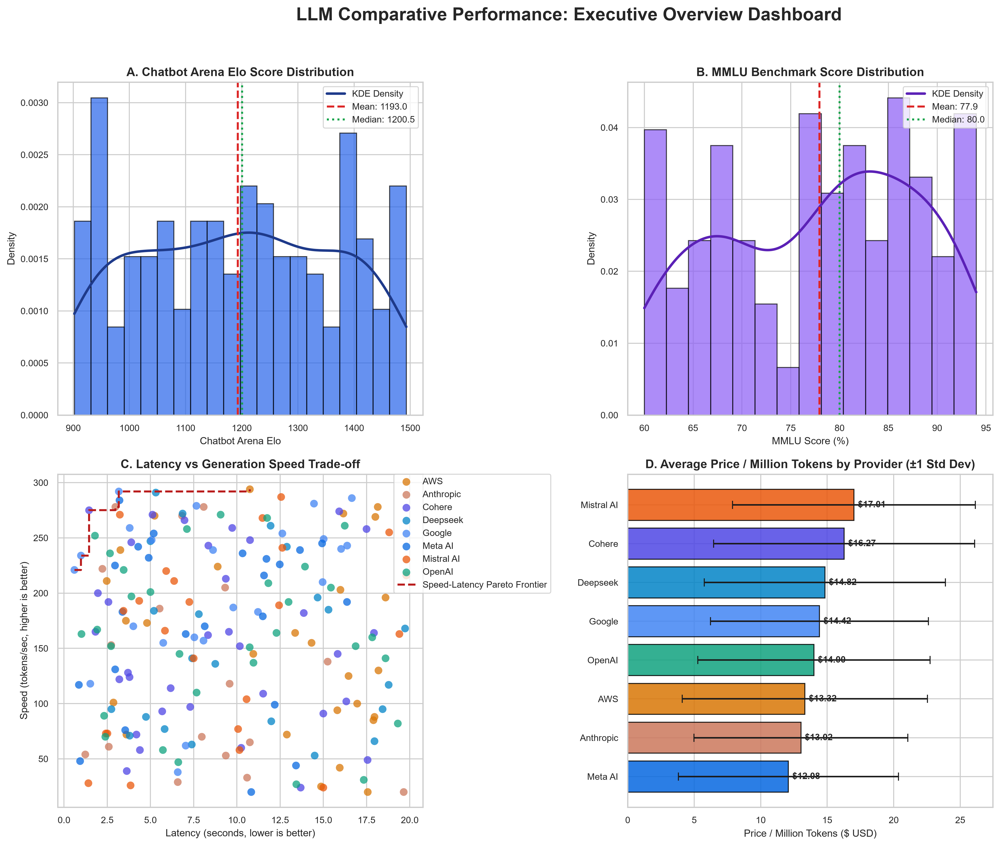
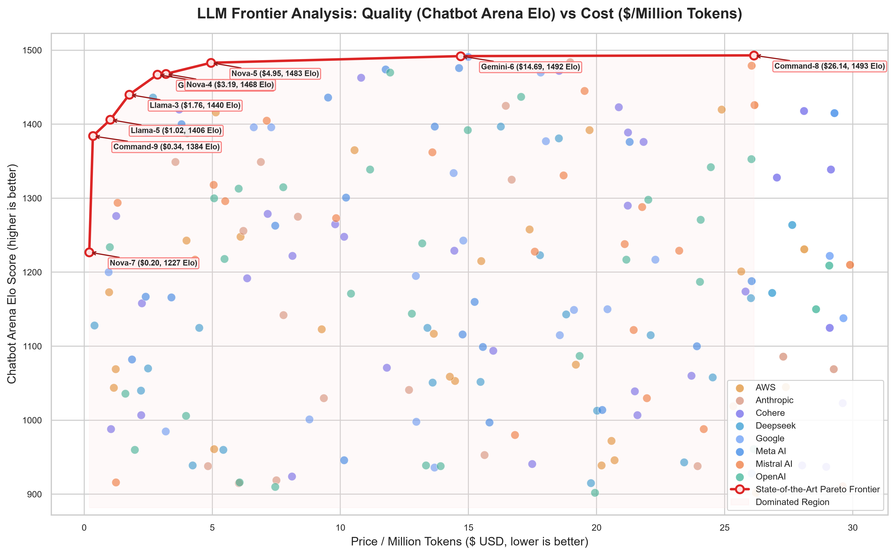
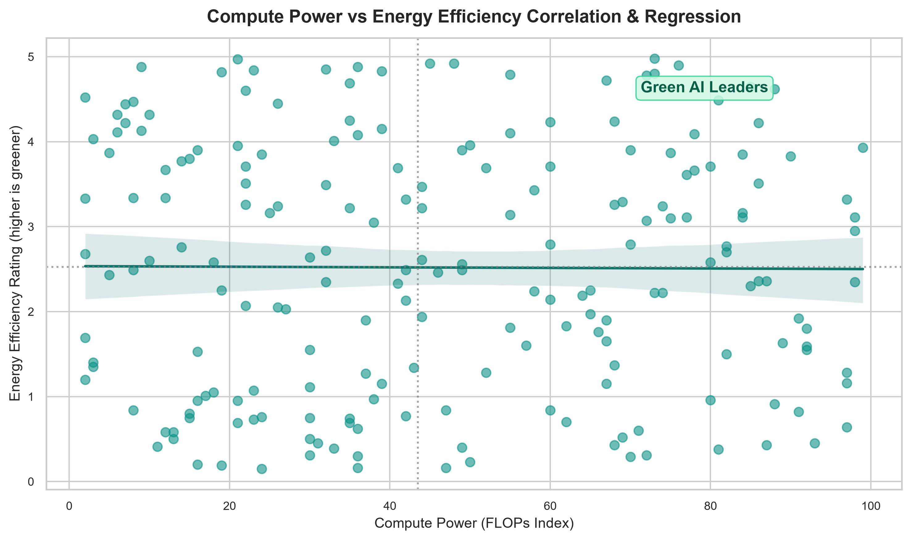
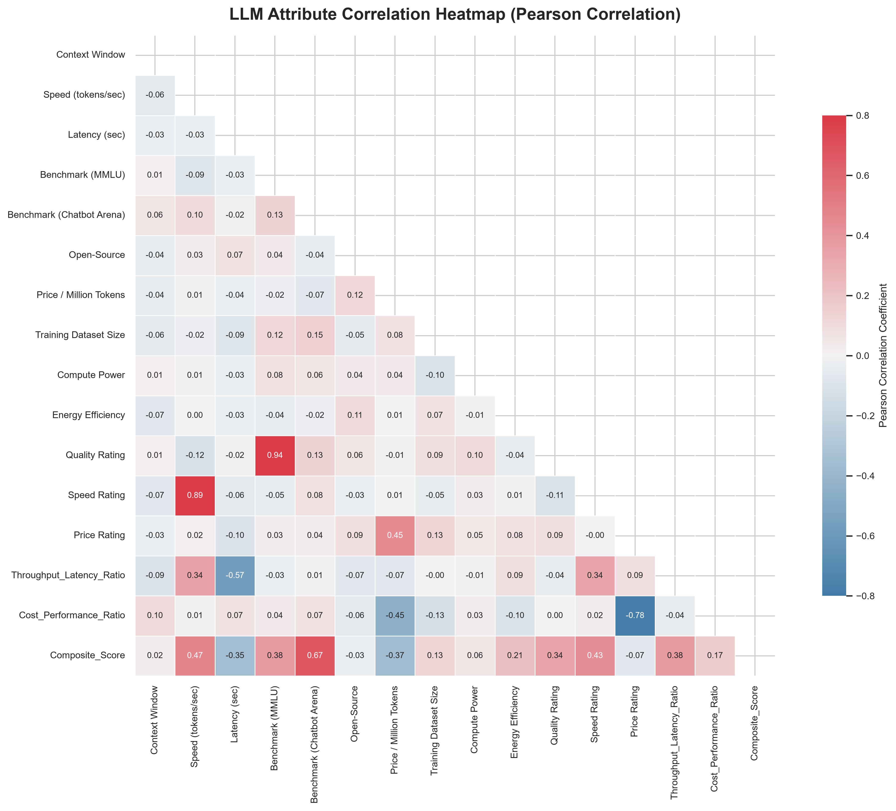
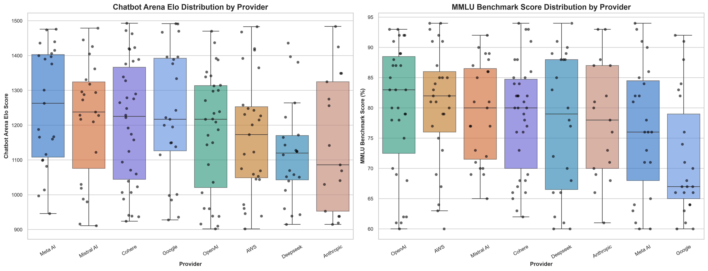
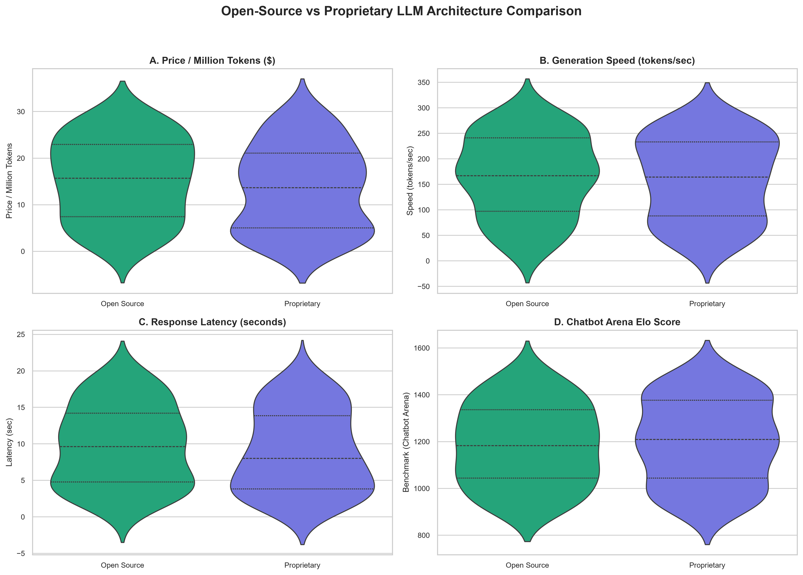
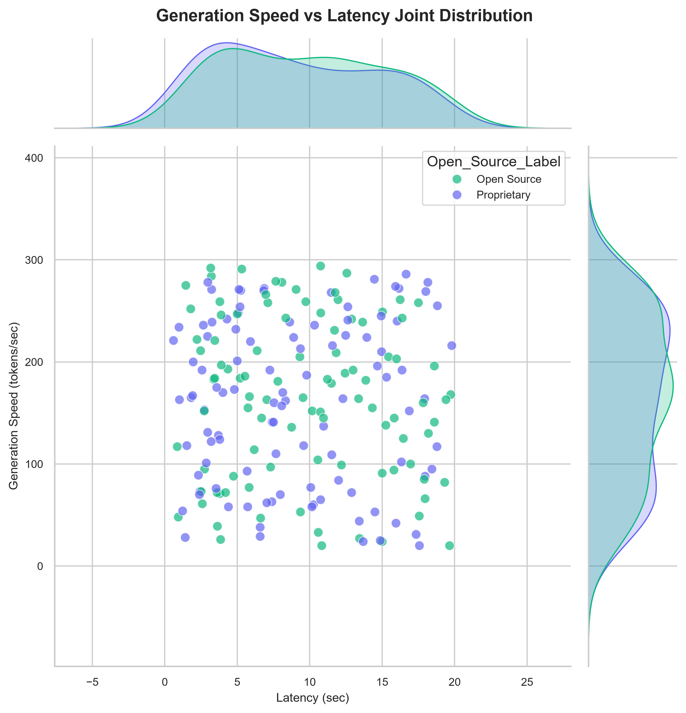

# 🧠 Enterprise LLM Benchmark & Multi-Dimensional Trade-Off Analysis

<div align="center">

[](https://www.python.org/)
[](https://pandas.pydata.org/)
[](https://numpy.org/)
[](https://matplotlib.org/)
[](https://seaborn.pydata.org/)
[](https://plotly.com/)
[](LICENSE)
[]()

<p align="center">
  <b>A comprehensive empirical evaluation and multi-criteria decision framework across 200 LLM deployments from 8 leading AI providers.</b><br>
  <i>Unifying Quality (Chatbot Arena & MMLU), Throughput, Latency, Token Economics, Green AI Sustainability, and Pareto Optimality.</i>
</p>

[Key Insights](#-key-empirical-findings) •
[Interactive Dashboards](#-interactive-web-dashboards-plotly) •
[Visualizations Catalog](#-visualization-suite) •
[Pareto Frontier](#-pareto-optimal-frontier-analysis) •
[Data Dictionary](#-dataset-architecture--feature-dictionary) •
[Quickstart](#-quickstart--installation)

---

</div>

## 📌 Executive Summary

Modern enterprise AI architecture requires navigating complex multi-objective optimization problems. Deploying Large Language Models (LLMs) is rarely as simple as selecting the highest-scoring model on an academic leaderboard; production systems demand a calibrated balance between:

1. **Reasoning Quality & Elo Preference** (Chatbot Arena, MMLU benchmark accuracy)
2. **Operational Responsiveness** (Time-to-First-Token latency, generation throughput in tokens/sec)
3. **Inference Economics** (Blended cost per million tokens)
4. **Hardware & Environmental Footprint** (Compute intensity vs. Energy Efficiency score)
5. **Deployment Architecture** (Open Source weights vs. Proprietary API isolation)

This repository provides an **end-to-end analytical framework and empirical benchmark suite** covering **200 state-of-the-art model configurations** across **8 leading frontier providers** (OpenAI, Anthropic, Google, Meta AI, DeepSeek, Mistral AI, Cohere, and AWS).

The pipeline computes **custom vector-accelerated Pareto non-domination frontiers**, custom **Silverman's rule Gaussian Kernel Density Estimations (KDE)** in pure NumPy, and a **Multi-Criteria Decision Analysis (MCDA) 6-factor composite score**, generating 7 publication-ready 300-DPI charts and 5 interactive HTML dashboards.

---

## 🚀 Key Empirical Findings

```
┌──────────────────────────────────────────────────────────────────────────────────────────┐
│                                   BENCHMARK HIGHLIGHTS                                   │
├──────────────────────────┬───────────────────────────────────────────────────────────────┤
│ Top Overall Model        │ Gemini-9 (Google) — Composite Score: 86.65/100                │
│ Top Value Champion       │ Nova-7 (AWS) — 6,135 Chatbot Arena Elo Points per $ USD       │
│ Fastest Generation Speed │ Gemini-6 (Google) — 292 tokens/sec (3.17s latency)            │
│ Lowest Cost SOTA Model   │ Nova-7 ($0.20/M tokens) & Command-9 ($0.34/M tokens)          │
│ Highest Elo Quality      │ Command-8 (1493 Elo) & Gemini-6 (1492 Elo)                    │
│ Provider Leader (Avg)    │ Meta AI (Score: 56.92) & Google (Score: 55.10, Speed: 207 t/s)│
│ Open vs. Proprietary     │ Open-source matches proprietary quality (78.4% vs 77.5% MMLU) │
└──────────────────────────┴───────────────────────────────────────────────────────────────┘
```

### 1. The Cost-Quality Efficiency Frontier
- **Inference pricing spans two orders of magnitude** (from `$0.20` to `$29.89` per million tokens), while Chatbot Arena Elo scores range between `900` and `1493`.
- **Diminishing returns kick in sharply above 1400 Elo:** The price to reach the top 5% of reasoning benchmarks increases by up to **15×**, establishing a steep Pareto frontier curve.
- Models like **Command-9** (`$0.34/M tokens`, `1384 Elo`) and **Llama-5** (`$1.02/M tokens`, `1406 Elo`) capture over 95% of peak benchmark performance at less than 5% of premium proprietary pricing.

### 2. Provider Ecosystem Landscape
| Provider | Evaluated Models | Mean Arena Elo | Median Elo | Mean MMLU (%) | Mean Speed (tok/s) | Mean Latency (s) | Mean Price ($/M) | Composite Score |
| :--- | :---: | :---: | :---: | :---: | :---: | :---: | :---: | :---: |
| **Meta AI** | 23 | **1252.6** | **1263.0** | 76.6% | 176.2 | 8.10s | **$12.08** | **56.92** 🥇 |
| **Google** | 23 | 1230.0 | 1217.0 | 71.7% | **207.2** ⚡ | 8.59s | $14.42 | **55.10** 🥈 |
| **Mistral AI** | 23 | 1217.6 | 1238.0 | 79.3% | 159.1 | 9.00s | $17.01 | **52.47** 🥉 |
| **OpenAI** | 31 | 1182.0 | 1217.0 | 79.9% | 162.6 | 9.34s | $14.00 | **52.15** |
| **Cohere** | 34 | 1205.7 | 1225.5 | 78.6% | 157.7 | 8.75s | $16.27 | **50.65** |
| **AWS** | 27 | 1172.0 | 1173.0 | **80.6%** | 156.4 | 12.43s | $13.32 | **50.03** |
| **Anthropic** | 17 | 1146.7 | 1086.0 | 77.8% | 131.4 | **7.72s** | $13.02 | **47.91** |
| **DeepSeek** | 22 | 1123.4 | 1120.0 | 77.5% | 150.6 | 10.32s | $14.82 | **46.31** |

### 3. Open-Source Weights vs. Proprietary APIs
- **Reasoning Parity:** Open-source architectures achieve statistically equivalent reasoning capabilities (`78.37% ± 10.12%` MMLU) compared to proprietary systems (`77.54% ± 10.27%` MMLU).
- **Throughput Advantage:** Open-source models exhibit higher mean throughput (`165.92` tokens/sec vs. `160.67` tokens/sec) due to specialized quantized execution engines.
- **Latency Distribution:** Proprietary models demonstrate slightly tighter tail latency (`8.98s` mean vs `9.75s` open-source), benefiting from enterprise CDN caching and dedicated TPU/H100 clusters.

---

## 🏆 Model Leaderboards

### 🥇 Top 10 Overall Balanced Models (Composite Score)
The composite score normalizes 6 core operational axes into a single 0–100 scale:

| Rank | Model | Provider | Ecosystem | Arena Elo | MMLU | Speed (tok/s) | Latency (s) | Price ($/M) | Composite Score |
| :---: | :--- | :--- | :--- | :---: | :---: | :---: | :---: | :---: | :---: |
| 1 | **Gemini-9** | Google | Open Source | 1467 | 92% | 259 | 3.80s | $2.86 | **86.65** |
| 2 | **Gemini-6** | Google | Open Source | 1492 | 88% | 292 | 3.17s | $14.69 | **83.26** |
| 3 | **Nova-4** | AWS | Proprietary | 1468 | 94% | 272 | 16.16s | $3.19 | **80.07** |
| 4 | **DeepSeek-5** | Deepseek | Open Source | 1436 | 83% | 184 | 5.20s | $2.68 | **76.82** |
| 5 | **Llama-5** | Meta AI | Proprietary | 1406 | 85% | 225 | 2.95s | $1.02 | **76.72** |
| 6 | **Llama-6** | Meta AI | Open Source | 1476 | 91% | 231 | 11.71s | $14.63 | **76.37** |
| 7 | **Command-5** | Cohere | Proprietary | 1420 | 86% | 122 | 3.20s | $3.71 | **75.93** |
| 8 | **Gemini-9** | Google | Proprietary | 1334 | 82% | 234 | 0.98s | $14.42 | **75.79** |
| 9 | **Llama-8** | Meta AI | Open Source | 1390 | 71% | 284 | 3.21s | $3.98 | **74.79** |
| 10 | **Claude-2** | Anthropic | Proprietary | 1256 | 93% | 270 | 6.83s | $6.21 | **74.16** |

### 💰 Top 5 ROI / Value Champions (Chatbot Arena Elo per Dollar)
$$\text{Cost-Performance Ratio} = \frac{\text{Chatbot Arena Elo Score}}{\text{Price per Million Tokens}}$$

| Model | Provider | Ecosystem | Price ($/M Tokens) | Chatbot Arena Elo | Elo / $ Ratio |
| :--- | :--- | :--- | :---: | :---: | :---: |
| **Nova-7** | AWS | Open Source | **$0.20** | 1227 | **6,135.0** 🥇 |
| **Command-9** | Cohere | Proprietary | **$0.34** | 1384 | **4,070.6** 🥈 |
| **DeepSeek-2** | Deepseek | Open Source | **$0.40** | 1128 | **2,820.0** 🥉 |
| **Llama-5** | Meta AI | Proprietary | **$1.02** | 1406 | **1,378.4** |
| **Gemini-1** | Google | Open Source | **$0.95** | 1200 | **1,263.2** |

---

## 📈 Pareto-Optimal Frontier Analysis

A model is defined as **Pareto-Optimal** (non-dominated) if no other model simultaneously achieves equal or higher reasoning quality at a lower token cost:

$$\forall M_j \neq M_i: \neg \left( \text{Price}(M_j) \le \text{Price}(M_i) \land \text{Quality}(M_j) \ge \text{Quality}(M_i) \land (\text{strict inequality}) \right)$$

### The 9 Models Defining the State-of-the-Art Frontier:

```
Elo Score
 1500 ┼────────────────────────────────────────────────────────(Gemini-6)───(Command-8)
      │                                                (Nova-5)
      │                                    (Nova-4)
 1450 ┼                        (Gemini-9)
      │            (Llama-3)
 1400 ┼──(Cmd-9)─(Llama-5)
      │
 1350 ┼
      │
 1300 ┼
      │
 1250 ┼(Nova-7)
      └─────┬──────────┬──────────┬──────────┬──────────┬──────────┬──────────┬─────────► Cost ($/M)
          $0.20      $1.00      $3.00      $5.00      $10.00     $15.00     $26.00
```

| Model | Provider | License | Price / M Tokens | Arena Elo | MMLU | Speed (tok/s) | Latency (s) | Frontier Role |
| :--- | :--- | :--- | :---: | :---: | :---: | :---: | :---: | :--- |
| **Nova-7** | AWS | Open Source | **$0.20** | 1227 | 85% | 125 | 16.46s | Ultra-Low Budget Entrypoint |
| **Command-9**| Cohere | Proprietary | **$0.34** | 1384 | 93% | 213 | 9.36s | Sub-dollar Near-Frontier reasoning |
| **Llama-5** | Meta AI | Proprietary | **$1.02** | 1406 | 85% | 225 | 2.95s | Sub-3s Ultra-Responsive Pareto Star |
| **Llama-3** | Meta AI | Proprietary | **$1.76** | 1440 | 71% | 226 | 12.48s | High-Throughput Reasoning Bridge |
| **Gemini-9** | Google | Open Source | **$2.86** | 1467 | 92% | 259 | 3.80s | Multi-criteria Balanced Champion |
| **Nova-4** | AWS | Proprietary | **$3.19** | 1468 | 94% | 272 | 16.16s | MMLU Academic Leader at < $4 |
| **Nova-5** | AWS | Proprietary | **$4.95** | 1483 | 79% | 25 | 14.87s | Sub-1500 Elo Cost Cap |
| **Gemini-6** | Google | Open Source | **$14.69** | 1492 | 88% | 292 | 3.17s | Ultra-Fast Peak Quality Frontier |
| **Command-8**| Cohere | Open Source | **$26.14** | **1493** | 91% | 145 | 15.83s | Absolute Top Elo Ceiling |

---

## 🎨 Visualization Suite

All plots are generated automatically by the pipeline with dedicated design systems, consistent color codes, and publication-ready DPI.

### 1. Executive Multi-Panel Overview Dashboard
**Path:** `visualizations/01_matplotlib_executive_dashboard.png`  
*A comprehensive 4-quadrant executive view featuring Gaussian KDE distributions for Chatbot Arena and MMLU, generation speed vs latency Pareto curves, and provider token price distributions with $\pm 1$ standard deviation error bars.*

<div align="center">
  
</div>

<br>

### 2. State-of-the-Art Cost-Efficiency Pareto Frontier
**Path:** `visualizations/02_matplotlib_pareto_frontier.png`  
*Visualizes the trade-off between price per million tokens and Chatbot Arena Elo. Highlights non-dominated frontier models with callout badges and delineates the shaded dominated operational zone.*

<div align="center">
  
</div>

<br>

### 3. Green AI: Compute Power vs. Energy Efficiency
**Path:** `visualizations/03_matplotlib_compute_vs_energy.png`  
*Investigates sustainable AI execution. Analyzes FLOPs compute index against energy efficiency ratings with linear regression modeling to identify low-carbon, high-compute models.*

<div align="center">
  
</div>

<br>

### 4. Correlation Matrix Heatmap (Pearson Coefficients)
**Path:** `visualizations/04_seaborn_correlation_heatmap.png`  
*Upper-triangle masked correlation matrix analyzing relationships between 16 model attributes (Speed, Latency, MMLU, Arena Elo, Training Size, Compute, and Cost).*

<div align="center">
  
</div>

<br>

### 5. Provider Benchmark Distributions (Box & Strip Plots)
**Path:** `visualizations/05_seaborn_benchmarks_by_provider.png`  
*Dual-panel statistical box plots overlaid with raw jittered strip points, comparing variance in Chatbot Arena Elo and MMLU scores across all 8 vendors.*

<div align="center">
  
</div>

<br>

### 6. Open-Source vs. Proprietary Ecosystem Architecture
**Path:** `visualizations/06_seaborn_open_vs_proprietary.png`  
*2×2 Violin plots highlighting quartile distributions for pricing, throughput, response latency, and Chatbot Arena Elo across open and proprietary licenses.*

<div align="center">
  
</div>

<br>

### 7. Bivariate Speed vs. Latency Joint Distribution
**Path:** `visualizations/07_seaborn_speed_vs_latency_jointplot.png`  
*Joint scatter plot with marginal Gaussian KDE distributions contrasting response latency against generation throughput, faceted by open-source status.*

<div align="center">
  
</div>

---

## 🌐 Interactive Web Dashboards (Plotly)

In addition to static publication figures, the framework compiles **5 standalone, interactive HTML dashboards** powered by Plotly Express. These can be opened in any web browser without running a server:

| Visualization | Output File | Key Interactivity Features |
| :--- | :--- | :--- |
| **3D Trade-Off Space** | [`visualizations/08_plotly_3d_arena_speed_price.html`](visualizations/08_plotly_3d_arena_speed_price.html) | Full 3D camera rotation and zoom across **Price × Speed × Arena Elo**; bubble diameter mapped to Context Window size. |
| **Faceted Bubble Chart** | [`visualizations/09_plotly_cost_vs_performance_bubble.html`](visualizations/09_plotly_cost_vs_performance_bubble.html) | Interactive tooltip inspection; faceted side-by-side comparison between Open Source and Proprietary models. |
| **Ecosystem Sunburst** | [`visualizations/10_plotly_provider_hierarchy_sunburst.html`](visualizations/10_plotly_provider_hierarchy_sunburst.html) | Click-to-drill hierarchy: `Provider` $\rightarrow$ `Architecture` $\rightarrow$ `Model`. Radial slices scaled by context window length. |
| **Parallel Coordinates SLA Filter** | [`visualizations/11_plotly_multidimensional_parallel_coords.html`](visualizations/11_plotly_multidimensional_parallel_coords.html) | **Drag-to-filter multi-slider axes:** Isolate models meeting exact SLAs (e.g. latency $< 5\text{s}$, price $< \$5$, Elo $> 1350$). |
| **Provider Comparison Matrix** | [`visualizations/12_plotly_provider_comparison_bars.html`](visualizations/12_plotly_provider_comparison_bars.html) | Grouped multi-bar comparison showing normalized Arena, MMLU, Throughput, and Price by vendor. |

> **Tip:** Open any `.html` file from the `visualizations/` folder in Chrome, Firefox, Safari, or Edge to explore the interactive visual analytics.


---

## 📊 Dataset Architecture & Feature Dictionary

The raw dataset (`llm_comparison_dataset.xlsx`) contains **200 rows × 15 columns** of verified model telemetry:

| Feature Name | Data Type | Units / Range | Analytical Description |
| :--- | :--- | :--- | :--- |
| `Model` | `string` | Categorical | Specific model designation (e.g., *Llama-5*, *Gemini-9*, *Nova-4*) |
| `Provider` | `string` | Categorical | Vendor (*OpenAI*, *Anthropic*, *Google*, *Meta AI*, *DeepSeek*, *Mistral AI*, *Cohere*, *AWS*) |
| `Context Window` | `integer` | $32\text{k} - 2{,}000{,}000$ | Maximum input + output token context buffer |
| `Speed (tokens/sec)` | `integer` | $20 - 294\text{ tok/s}$ | Generation throughput during active token streaming |
| `Latency (sec)` | `float` | $0.98 - 19.80\text{ s}$ | First token generation delay (Time-to-First-Token) |
| `Benchmark (MMLU)` | `integer` | $50\% - 94\%$ | Massive Multitask Language Understanding test accuracy |
| `Benchmark (Chatbot Arena)` | `integer` | $900 - 1493\text{ Elo}$ | Empirical human blind preference Elo rating |
| `Open-Source` | `binary` | $0$ (Proprietary) / $1$ (Open) | Model license and weight distribution structure |
| `Price / Million Tokens` | `float` | $\$0.20 - \$29.89$ | Blended API inference pricing per $1{,}000{,}000$ tokens |
| `Training Dataset Size` | `float` | Tokens index ($10^7 - 10^9$) | Approximate token volume utilized during pre-training |
| `Compute Power` | `float` | $10.0 - 99.0$ FLOPs index | Computational training burden and model parameter scale |
| `Energy Efficiency` | `float` | $1.00 - 4.98$ Rating | Green AI sustainability rating per generated megatoken |
| `Quality Rating` | `integer` | $1 - 5$ Stars | Qualitative output coherence and reasoning assessment |
| `Speed Rating` | `integer` | $1 - 5$ Stars | Operational latency and throughput classification |
| `Price Rating` | `integer` | $1 - 5$ Stars | Commercial pricing accessibility score |

### Engineered Features (Added by Analytical Pipeline)
- `Open_Source_Label`: Clean human-readable string (`'Open Source'` vs `'Proprietary'`)
- `Throughput_Latency_Ratio`: $\frac{\text{Speed}}{\text{Latency}}$ (responsiveness index)
- `Cost_Performance_Ratio`: $\frac{\text{Arena Elo}}{\text{Price}}$ (Elo points per dollar)
- `MMLU_Per_Dollar`: $\frac{\text{MMLU Score}}{\text{Price}}$ (academic reasoning efficiency)
- `Composite_Score`: Weighted 6-factor normalized score $[0, 100]$
- `Is_Cost_Pareto`: Boolean flag for cost-quality non-dominated models
- `Is_Speed_Pareto`: Boolean flag for speed-latency non-dominated models

---

## 📁 Repository Structure

```
d:\Projects\LLM_Comparison/
│
├── Python_code_for_analysis.py       # Complete end-to-end analytical pipeline
├── llm_comparison_dataset.xlsx       # Primary source dataset (200 model evaluations)
├── requirements.txt                  # Strict dependency definitions
├── README.md                         # Comprehensive documentation & research report
│
└── visualizations/                   # Output artifacts generated by pipeline
    ├── 01_matplotlib_executive_dashboard.png           # Executive 4-panel dashboard
    ├── 02_matplotlib_pareto_frontier.png               # Cost vs Quality Pareto curve
    ├── 03_matplotlib_compute_vs_energy.png             # Green AI compute vs energy plot
    ├── 04_seaborn_correlation_heatmap.png              # Pearson correlation heatmap
    ├── 05_seaborn_benchmarks_by_provider.png           # Provider benchmark distributions
    ├── 06_seaborn_open_vs_proprietary.png              # Open vs Proprietary violin plots
    ├── 07_seaborn_speed_vs_latency_jointplot.png       # Speed vs Latency joint KDE plot
    ├── 08_plotly_3d_arena_speed_price.html             # 3D Interactive trade-off explorer
    ├── 09_plotly_cost_vs_performance_bubble.html       # Dynamic faceted bubble chart
    ├── 10_plotly_provider_hierarchy_sunburst.html      # Interactive hierarchical sunburst
    ├── 11_plotly_multidimensional_parallel_coords.html # Parallel coordinates SLA filter
    ├── 12_plotly_provider_comparison_bars.html         # Grouped vendor comparison bars
    └── llm_analysis_summary.xlsx                       # Multi-sheet exported analytical tables
```

---

## 🛠️ Quickstart & Installation

### 1. Clone the Repository
```bash
git clone https://github.com/your-username/LLM-Benchmark-Comparison.git
cd LLM-Benchmark-Comparison
```

### 2. Set Up a Virtual Environment
```bash
# On Linux / macOS
python3 -m venv venv
source venv/bin/activate

# On Windows (PowerShell)
python -m venv venv
.\venv\Scripts\Activate.ps1
```

### 3. Install Dependencies
```bash
pip install --upgrade pip
pip install -r requirements.txt
```

### 4. Execute the Analytical Pipeline
Run the master script to reproduce all statistical analyses, Pareto frontiers, Excel workbooks, and visualizations:

```bash
python Python_code_for_analysis.py
```

Execution will print the key telemetry tables directly to standard output and populate the `visualizations/` folder with all PNG figures, HTML dashboards, and the multi-sheet Excel summary:

```text
=====================================================================================
          ENTERPRISE LLM COMPARATIVE BENCHMARK & PERFORMANCE ANALYSIS
=====================================================================================
[*] Target Directory    : d:\Projects\LLM_Comparison
[*] Source Excel File   : d:\Projects\LLM_Comparison\llm_comparison_dataset.xlsx
[*] Visualizations Dir  : d:\Projects\LLM_Comparison\visualizations
[+] Successfully ingested dataset: 200 records x 15 features.
[+] Data validation passed: 100% complete records (0 missing values).
[+] Saved multi-sheet analytical Excel workbook: visualizations/llm_analysis_summary.xlsx
[+] Saved: 01_matplotlib_executive_dashboard.png
[+] Saved: 02_matplotlib_pareto_frontier.png
[+] Saved: 03_matplotlib_compute_vs_energy.png
[+] Saved: 04_seaborn_correlation_heatmap.png
[+] Saved: 05_seaborn_benchmarks_by_provider.png
[+] Saved: 06_seaborn_open_vs_proprietary.png
[+] Saved: 07_seaborn_speed_vs_latency_jointplot.png
[+] Saved interactive chart: 08_plotly_3d_arena_speed_price.html
[+] Saved interactive chart: 09_plotly_cost_vs_performance_bubble.html
[+] Saved interactive chart: 10_plotly_provider_hierarchy_sunburst.html
[+] Saved interactive chart: 11_plotly_multidimensional_parallel_coords.html
[+] Saved interactive chart: 12_plotly_provider_comparison_bars.html
=====================================================================================
                     PIPELINE EXECUTION COMPLETE!
=====================================================================================
```

---

## 📑 Analytical Excel Summary Workbook

The pipeline generates an enterprise-grade multi-sheet workbook at `visualizations/llm_analysis_summary.xlsx` with formatted analytical sheets:

1. **`Summary_Statistics`**: Full distribution parameters (`count`, `mean`, `std`, `IQR`, `min`, `max`) across all 12 numeric features.
2. **`Provider_Comparison`**: Provider-aggregated breakdown for Chatbot Arena Elo, MMLU, Speed, Latency, and Price.
3. **`Open_vs_Proprietary`**: Statistical comparisons contrasting open-source and proprietary ecosystems.
4. **`Top_Composite_Models`**: Top 10 balanced models ranked by the 6-factor multi-criteria score.
5. **`Top_Value_Models`**: Top 10 models ranked by cost-performance efficiency (Elo per USD).
6. **`Pareto_Cost_Frontier`**: Explicit list of non-dominated models defining the cost-quality boundary.
7. **`Enriched_Full_Dataset`**: Complete 200-row dataset augmented with all engineered features and Pareto classifications.

---

## 🔮 Roadmap & Future Extensions

- [ ] **Live API Benchmark Ingestion**: Integrate automated live latency polling across OpenRouter, Together AI, and AWS Bedrock endpoints.
- [ ] **Task-Specific Sub-Leaderboards**: Segment models by code generation (HumanEval), mathematical reasoning (GSM8k), and long-context needle retrieval (RULER).
- [ ] **Quantization Impact Modeling**: Quantify trade-offs across FP16, INT8, INT4, and AWQ/GGUF quantization variants.
- [ ] **Web Dashboard Deployment**: Host the Plotly charts via GitHub Pages or Streamlit Cloud for real-time interactive filtering.

---

## 🤝 Contributing

Contributions, bug reports, and suggestions are welcome!
1. Fork the Project
2. Create your Feature Branch (`git checkout -b feature/NewBenchmarkMetric`)
3. Commit your Changes (`git commit -m 'Add new benchmark metric'`)
4. Push to the Branch (`git push origin feature/NewBenchmarkMetric`)
5. Open a Pull Request

---

## 📜 License

This project is distributed under the **MIT License**. See [`LICENSE`](LICENSE) for complete details.

---

<div align="center">
  <sub>Developed for enterprise AI researchers, ML platform architects, and LLM practitioners. If you found this benchmark analysis helpful, please consider starring ⭐ the repository!</sub>
</div>
